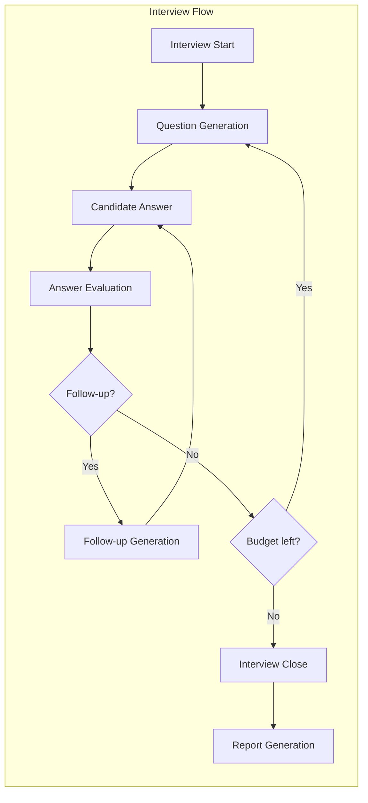

# AI Architecture — InterviewPrepApp

## H. AI Architecture

### Overview

The AI system has four distinct responsibilities, each with its own prompt chain and validation:



### 1. LLM Provider Abstraction

```
LLMProvider (Abstract)
├── chat_completion(messages, schema) → structured response
├── validate_response(response, schema) → validated data
└── get_usage() → token counts

Implementations:
├── OpenAIProvider (initial — gpt-4o for evaluation, gpt-4o-mini for generation)
├── AnthropicProvider (future)
└── MockProvider (testing — returns predetermined responses)
```

**Key design decisions:**

1. **Two-tier model usage**: Use a more capable model (gpt-4o) for answer evaluation and report generation (where quality matters most), and a faster/cheaper model (gpt-4o-mini) for question generation (where speed matters more). This is configurable per operation.

2. **Structured outputs**: All LLM calls request JSON output matching a Pydantic schema. The provider validates the response against the schema and retries (up to 2 times) if validation fails.

3. **Provider is stateless**: The provider handles a single request-response cycle. Interview context is managed by the Interview Engine, not the provider.

### 2. Question Generation

**Input context sent to the LLM:**
```
- Role (e.g., Backend Developer)
- Experience level (e.g., Junior)
- Target skill area (e.g., Python)
- Target difficulty (e.g., medium)
- Questions already asked (list of question texts — to avoid repetition)
- Skills already covered (to ensure breadth)
- Interview progress (question 5 of 10)
- Previous question + answer + evaluation (for continuity)
```

**Prompt structure:**
```
System prompt:
  "You are a technical interviewer conducting a {role} interview
   for a {experience_level} candidate. You are currently on question
   {n} of {total}. Ask a {difficulty} question about {skill_area}."

Context:
  - Questions already asked
  - Last Q&A exchange (if any)
  - Skill coverage status

Instructions:
  - Ask exactly one question
  - Make it appropriate for {experience_level}
  - Do not repeat topics already covered
  - Output as structured JSON
```

**Output schema:**
```json
{
  "question_text": "string — the interview question",
  "difficulty": "easy|medium|hard",
  "skill_area": "string — primary skill being tested",
  "reasoning": "string — why this question was chosen (internal, not shown to candidate)"
}
```

### 3. Follow-up Generation

Triggered when the evaluator recommends a follow-up (incomplete answer, interesting response worth probing, or wrong answer worth exploring).

**Additional context:**
```
- Original question
- Candidate's answer
- Evaluation result (scores, identified gaps)
- Follow-up reason from evaluator
```

**Output schema:**
```json
{
  "question_text": "string — the follow-up question",
  "difficulty": "easy|medium|hard",
  "follow_up_purpose": "probe_deeper|clarify|explore_practical|correct_misconception"
}
```

### 4. Answer Evaluation

This is the most critical AI operation — it directly determines scores and feedback quality.

**Input:**
```
- The question asked
- The candidate's answer
- Role and experience level (for calibration)
- Evaluation rubric (explicit criteria)
```

**Evaluation rubric (sent as part of the prompt):**

```
SCORING RUBRIC (0-10 scale):

Technical Correctness (0-10):
  0-2: Fundamentally wrong or no relevant content
  3-4: Partially correct with significant errors
  5-6: Mostly correct with minor errors or omissions
  7-8: Correct with good understanding shown
  9-10: Excellent, comprehensive, technically precise

Conceptual Depth (0-10):
  0-2: Surface-level or no understanding
  3-4: Basic understanding without depth
  5-6: Adequate understanding, some depth
  7-8: Good depth, understands nuances
  9-10: Expert-level depth, explains edge cases and trade-offs

Communication Clarity (0-10):
  0-2: Incoherent or very unclear
  3-4: Understandable but poorly structured
  5-6: Clear but could be better organized
  7-8: Well-structured and clear
  9-10: Exceptionally clear, would explain well to any audience

Relevance (0-10):
  0-2: Answer is off-topic
  3-4: Partially relevant, much irrelevant content
  5-6: Mostly relevant with some tangents
  7-8: Directly addresses the question
  9-10: Perfectly targeted answer

Problem Solving (0-10):
  0-2: No problem-solving approach evident
  3-4: Weak approach, misses key aspects
  5-6: Reasonable approach with gaps
  7-8: Good systematic approach
  9-10: Excellent approach, considers edge cases

Completeness (0-10):
  0-2: Missing most key points
  3-4: Covers some key points
  5-6: Covers main points, misses secondary ones
  7-8: Comprehensive, covers most points
  9-10: Thorough and complete
```

**Output schema:**
```json
{
  "technical_correctness": 8,
  "conceptual_depth": 6,
  "communication_clarity": 7,
  "relevance": 9,
  "problem_solving": 7,
  "completeness": 6,
  "overall_score": 7,
  "strengths": ["list of specific strengths"],
  "weaknesses": ["list of specific areas for improvement"],
  "feedback": "2-3 sentence constructive feedback",
  "follow_up_recommended": true,
  "follow_up_reason": "Candidate mentioned REST but didn't explain statelessness — worth probing"
}
```

### 5. Report Generation

After all questions are answered, the Report Generator aggregates individual evaluations and produces the final report.

**Process:**
```
1. Collect all (question, answer, evaluation) triples
2. Calculate weighted category scores:
   - Technical Score = weighted average of technical_correctness + conceptual_depth + completeness
   - Communication Score = weighted average of communication_clarity
   - Problem-Solving Score = weighted average of problem_solving + relevance
3. Send full interview transcript + evaluations to LLM for qualitative analysis
4. LLM produces: summary, strengths, weaknesses, recommendations, readiness assessment
5. Combine quantitative scores + qualitative analysis into final report
6. Validate against report schema
```

**Score aggregation (quantitative — no LLM involved):**

```
For each category, the score is a weighted average of per-question scores,
normalized to 0-100:

technical_score = (
  avg(technical_correctness) * 0.4 +
  avg(conceptual_depth) * 0.35 +
  avg(completeness) * 0.25
) * 10

communication_score = avg(communication_clarity) * 10

problem_solving_score = (
  avg(problem_solving) * 0.6 +
  avg(relevance) * 0.4
) * 10

overall_score = (
  technical_score * 0.45 +
  communication_score * 0.25 +
  problem_solving_score * 0.30
)

confidence_score = derived from consistency of scores across questions
  (low variance = high confidence, high variance = lower confidence)
```

**Readiness level mapping:**
```
0-30:   not_ready     — Significant gaps, needs substantial preparation
31-50:  needs_work    — Foundation exists but important areas need improvement
51-70:  almost_ready  — Good preparation, a few areas to strengthen
71-85:  ready         — Well-prepared for interviews at this level
86-100: strong        — Excellent preparation, likely to perform well
```

This scoring is **deterministic and transparent** — the candidate can understand exactly why they received each score. The LLM contributes qualitative insights (strengths/weaknesses/recommendations) but does NOT determine the numerical scores, preventing arbitrary or inconsistent scoring.

### 6. Context Management

The Interview Engine maintains a context window for the LLM that grows throughout the interview:

```
Interview Context:
├── Static Context
│   ├── Role definition
│   ├── Experience level
│   ├── Skill areas + weights
│   └── Evaluation rubric
├── Dynamic Context (grows)
│   ├── Questions asked (text only, most recent 5 in full)
│   ├── Answers received (text only, most recent 3 in full)
│   ├── Evaluations (scores only, most recent 3 with feedback)
│   ├── Skills covered vs. remaining
│   └── Current difficulty level
└── Operational Context
    ├── Question number / budget
    ├── Follow-up depth (max 2 follow-ups per topic)
    └── Time elapsed
```

**Context window management strategy:**
- For the first 5 questions: send full history
- After 5 questions: send full context for last 3 Q&As, summarized context for earlier ones
- This prevents context window overflow while maintaining conversational coherence
- All data is still in the database — context trimming is only for the LLM prompt

### 7. Prompt Management

```
prompts/
├── v1/
│   ├── interviewer/
│   │   ├── system.txt          — interviewer persona and behavior rules
│   │   ├── question_generation.txt  — template for generating questions
│   │   ├── follow_up.txt       — template for follow-up questions
│   │   └── interview_close.txt — closing the interview
│   ├── evaluator/
│   │   ├── answer_evaluation.txt   — per-answer evaluation
│   │   └── rubric.txt              — scoring criteria (referenced by evaluation prompt)
│   └── reporter/
│       └── report_generation.txt   — final report qualitative analysis
└── v2/  (future versions)
```

Each prompt file is a Jinja2-style template with placeholders:
```
You are a technical interviewer for the role of {{ role_name }}.
The candidate has {{ experience_level }} experience.
This is question {{ question_number }} of {{ total_questions }}.
```

The Prompt Manager:
1. Loads templates from disk (cached in memory)
2. Renders templates with provided context variables
3. Tracks which version was used (stored on evaluations/reports)
4. Supports switching versions via configuration (not code changes)

### 8. Error Handling & Resilience

```
LLM Call
├── Success → validate schema → use result
├── Schema validation fails → retry with "fix your JSON" prompt (max 2 retries)
├── LLM API error → retry with exponential backoff (max 3 retries)
├── LLM timeout → retry once, then return graceful error
└── All retries failed → return fallback
    ├── Question generation: use seed question from database
    ├── Evaluation: mark as "evaluation_pending" and continue
    └── Report: allow manual retry via API
```
