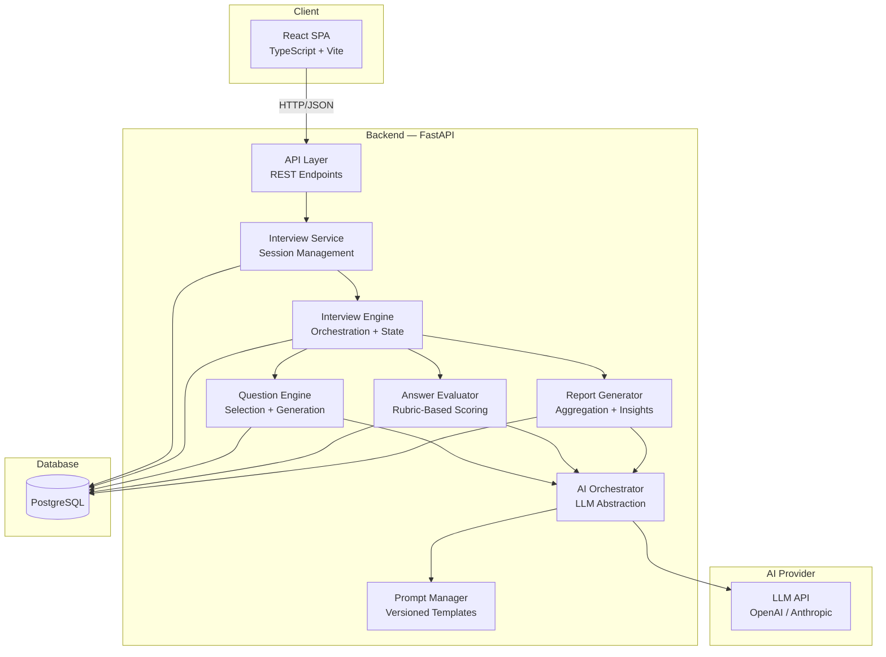
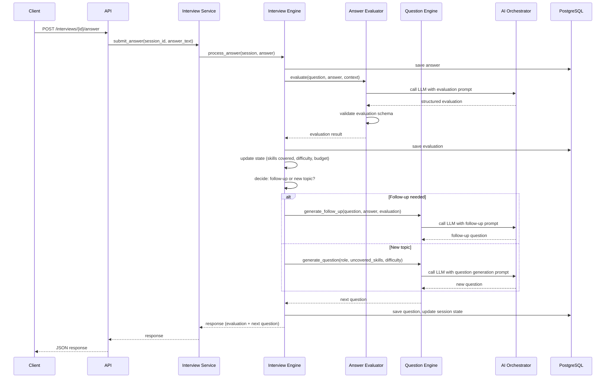

# System Architecture — InterviewPrepApp

## E. System Architecture

### Architecture Style: Modular Monolith

The POC uses a **two-process architecture**: a React SPA frontend served by Vite (dev) or static hosting (prod), and a Python FastAPI backend organized as a modular monolith. This is the simplest architecture that validates the core hypothesis while remaining evolvable.

Why NOT microservices: the POC has one team, one deployment, and no independent scaling requirements. A monolith with clean module boundaries can be split later if needed — premature decomposition would add network hops, deployment complexity, and debugging friction for zero benefit at this stage.

### High-Level Architecture



### Component Responsibilities

| Component | Responsibility |
|-----------|---------------|
| **API Layer** | HTTP handling, request validation, response serialization, error mapping. No business logic. |
| **Interview Service** | Session lifecycle (create, start, complete, retrieve). Coordinates between API and Interview Engine. |
| **Interview Engine** | Core orchestration: maintains interview state, decides next action (follow-up vs. new topic), tracks question budget, manages difficulty progression. This is the "brain" of the interview flow. |
| **Question Engine** | Generates or selects questions based on role, skill areas, difficulty, and interview context. Uses LLM for dynamic generation. |
| **Answer Evaluator** | Evaluates candidate answers against the scoring rubric. Produces structured evaluation with scores, feedback, and follow-up recommendation. |
| **Report Generator** | Aggregates per-question evaluations into the final interview report. Computes category scores, identifies patterns, generates recommendations. |
| **AI Orchestrator** | Abstraction over LLM providers. Handles prompt rendering, API calls, response parsing, retries, and output validation. |
| **Prompt Manager** | Loads, versions, and renders prompt templates. Keeps prompts out of business logic code. |

### Request Flow: Submit Answer



### Technology Stack

| Layer | Technology | Version |
|-------|-----------|---------|
| Frontend | React + TypeScript | React 18, TS 5.x |
| Build tool | Vite | 5.x |
| Routing | React Router | v6 |
| Data fetching | TanStack Query | v5 |
| Styling | Tailwind CSS | v3 |
| Backend | Python + FastAPI | Python 3.11+, FastAPI 0.110+ |
| ORM | SQLAlchemy | 2.x |
| Validation | Pydantic | v2 |
| Migrations | Alembic | 1.x |
| Database | PostgreSQL | 16 |
| Containerization | Docker + Docker Compose | — |
| AI Provider | OpenAI (initial) | gpt-4o / gpt-4o-mini |
| Testing (BE) | pytest | 8.x |
| Testing (FE) | Vitest + React Testing Library | — |

### Deployment Architecture (POC)

```
docker-compose.yml
├── frontend (Vite dev server or nginx for built assets)
├── backend (FastAPI with uvicorn)
└── postgres (PostgreSQL 16)
```

Single `docker-compose up` starts everything. No orchestrator needed for POC.
