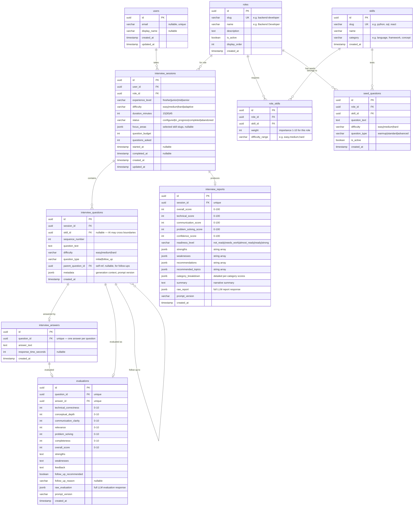

# Database Design — InterviewPrepApp

## F. Database Design

### Design Decisions

**Question Generation Strategy: Hybrid (Dynamic Generation + Seed Bank)**

For the POC, questions are **primarily generated dynamically by the LLM** based on role, skill area, difficulty, and interview context. This is the right choice because:

1. **Quality**: LLM-generated questions are contextual — they can follow up on previous answers, adjust difficulty, and avoid repetition naturally.
2. **Coverage**: We don't need to manually author hundreds of questions for 3 roles × 4 experience levels × multiple skill areas.
3. **Flexibility**: Adding a new role only requires defining its skill areas, not writing a question bank.
4. **Realism**: Real interviewers don't read from a script — they adapt. Dynamic generation replicates this.

However, we include a **seed question bank** (stored in the database) for:
- Warm-up / opening questions per role (predictable starting points)
- Fallback if LLM generation fails
- Future analytics (comparing AI-generated vs. curated questions)

**User Identity: Session-Based for POC**

No authentication in the POC. Users get a session token (UUID stored in browser localStorage). This is sufficient to link interview history. Authentication can be layered on later without schema changes — the `users` table already exists with an `email` field.

### Entity-Relationship Diagram

### Key Design Decisions

**1. Why `jsonb` for some fields?**
Fields like `focus_areas`, `strengths`, `weaknesses`, `recommendations` are arrays or semi-structured data that don't warrant their own tables at POC stage. PostgreSQL's `jsonb` provides indexed querying if needed later. These can be normalized into separate tables when the data model stabilizes.

**2. Why separate `evaluations` and `interview_reports`?**
Evaluations are per-question (granular, real-time). Reports are per-session (aggregated, generated once at completion). They serve different purposes and are generated at different times.

**3. Why `parent_question_id` on questions?**
Follow-up questions reference their parent. This creates a question tree that preserves the interview conversation structure, enabling the report to show "Question → Follow-up → Follow-up" chains.

**4. Why `prompt_version` on evaluations and reports?**
When we change prompts, evaluation quality may shift. Tracking which prompt version produced each evaluation enables comparison and quality assurance.

**5. Why `raw_evaluation` / `raw_report` jsonb fields?**
We store the full LLM response alongside the extracted/validated fields. This is essential for debugging, quality analysis, and prompt improvement — we can always re-parse old responses.

### Indexes

| Table | Index | Purpose |
|-------|-------|---------|
| `interview_sessions` | `(user_id, created_at DESC)` | User's interview history |
| `interview_sessions` | `(status)` | Find active/abandoned sessions |
| `interview_questions` | `(session_id, sequence_number)` | Ordered questions per session |
| `evaluations` | `(question_id)` | Lookup evaluation for a question |
| `interview_reports` | `(session_id)` | Lookup report for a session |
| `role_skills` | `(role_id, skill_id)` | Unique constraint |
| `seed_questions` | `(role_id, skill_id, difficulty)` | Question selection |

### Constraints

- `interview_answers.question_id` is UNIQUE (one answer per question)
- `evaluations.question_id` is UNIQUE (one evaluation per question)
- `interview_reports.session_id` is UNIQUE (one report per session)
- `role_skills.(role_id, skill_id)` is UNIQUE
- `roles.slug` is UNIQUE
- `skills.slug` is UNIQUE
- `interview_sessions.status` CHECK constraint on valid values
- `evaluations` score fields CHECK constraint: `0 <= score <= 10`
- `interview_reports` score fields CHECK constraint: `0 <= score <= 100`
