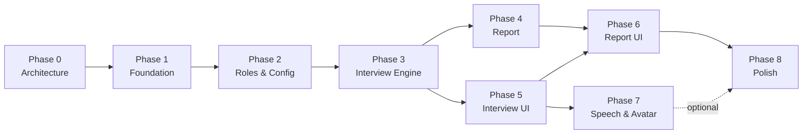

# Implementation Roadmap — InterviewPrepApp

## M. Phase Roadmap

---

### Phase 0 — Product & Architecture ✅
**Objective:** Define the product, validate the architecture, align on technical decisions.

**Deliverables:**
- Product requirements document
- System architecture with diagrams
- Database schema design
- API contract
- AI architecture and scoring methodology
- Frontend and backend architecture
- Technology decisions
- Implementation roadmap
- Risk assessment

**Acceptance Criteria:**
- [ ] All architecture documents reviewed and approved
- [ ] No open questions blocking implementation
- [ ] Data model supports the full interview lifecycle
- [ ] API contract covers all user journeys
- [ ] Scoring methodology is transparent and deterministic

---

### Phase 1 — Project Foundation
**Objective:** Set up both projects with working dev environments, database, Docker, and health checks. At the end, both frontend and backend run, connect to PostgreSQL, and respond to health checks.

**Tasks:**
1. Initialize Git repository
2. Set up backend: FastAPI project, pyproject.toml, dependencies, app factory
3. Set up frontend: Vite + React + TypeScript, dependencies, basic app shell
4. PostgreSQL setup with Docker Compose
5. SQLAlchemy database connection + session management
6. Alembic initialization
7. Backend health check endpoint (`GET /api/v1/health`)
8. Frontend proxy configuration (Vite → backend API)
9. `.env.example` with all required environment variables
10. Docker Compose: frontend, backend, postgres
11. Basic project README with setup instructions

**Deliverables:**
- Working `docker-compose up` that starts all services
- Health check endpoint returning `{"status": "healthy", "database": "connected"}`
- Frontend renders a basic page and can call the backend API
- Database migrations run on startup

**Dependencies:** Phase 0 approval

**Acceptance Criteria:**
- [ ] `docker-compose up` starts frontend, backend, and database
- [ ] `GET /api/v1/health` returns 200 with database connected
- [ ] Frontend loads in browser at localhost:5173
- [ ] Frontend can call backend API through proxy
- [ ] Alembic migration infrastructure works
- [ ] All type checking passes (mypy / tsc)
- [ ] Basic test runs (health check test)

---

### Phase 2 — Roles, Skills & Interview Configuration
**Objective:** Build the data layer for roles and skills, seed it with initial data for 3 roles, and create the interview configuration flow (backend + frontend).

**Tasks:**
1. Database models: User, Role, Skill, RoleSkill, SeedQuestion
2. Alembic migration for these tables
3. Seed data: 3 roles with skills and weights
4. Repository layer: RoleRepository
5. Service layer: RoleService
6. API endpoints: `GET /roles`, `GET /roles/{id}/skills`
7. API endpoint: `POST /interviews` (create configured interview session)
8. Pydantic schemas for all request/response types
9. Frontend: Landing page
10. Frontend: Interview setup page (role selection, experience, configuration)
11. Frontend: API client for roles and interview creation
12. Tests: API tests for roles and interview creation

**Deliverables:**
- 3 roles with full skill definitions seeded in database
- Working role selection and interview configuration UI
- Interview session created and persisted on configuration

**Dependencies:** Phase 1

**Acceptance Criteria:**
- [ ] `GET /api/v1/roles` returns 3 roles with skills
- [ ] `POST /api/v1/interviews` creates a session with status "configured"
- [ ] Frontend displays role cards with descriptions
- [ ] User can select role, experience level, and configure interview
- [ ] Interview session is created in database after configuration
- [ ] Seed data loads correctly on fresh database
- [ ] API tests pass

---

### Phase 3 — Interview Engine (Core)
**Objective:** Build the interview engine that can conduct an interview: start, generate questions, accept answers, evaluate, decide follow-ups, track state, and complete. This is the most critical phase.

**Tasks:**
1. Database models: InterviewQuestion, InterviewAnswer, Evaluation
2. Alembic migration
3. LLM provider abstraction + OpenAI implementation + Mock provider
4. Prompt manager + v1 prompt templates (system, question generation, follow-up, evaluation)
5. AI orchestrator (manages provider, retries, schema validation)
6. InterviewState dataclass
7. QuestionEngine (question generation + follow-up generation)
8. AnswerEvaluator (rubric-based evaluation)
9. InterviewEngine (orchestration: start → question → answer → evaluate → next)
10. InterviewService (session lifecycle)
11. API endpoints: `POST /interviews/{id}/start`, `POST /interviews/{id}/answer`, `POST /interviews/{id}/complete`
12. Pydantic schemas for AI output validation
13. Tests: InterviewEngine state transitions, QuestionEngine, AnswerEvaluator, AI schema validation
14. Integration test: full interview flow with mock LLM

**Deliverables:**
- Complete interview engine that can conduct a multi-question interview
- Answer evaluation with structured scoring
- Follow-up question logic
- Adaptive difficulty progression
- All interview data persisted

**Dependencies:** Phase 2

**Acceptance Criteria:**
- [ ] `POST /interviews/{id}/start` returns interviewer intro + first question
- [ ] `POST /interviews/{id}/answer` evaluates answer and returns next question
- [ ] Follow-up questions are generated when evaluation recommends them
- [ ] Questions progress across skill areas
- [ ] Difficulty adapts based on performance
- [ ] No question/topic repetition
- [ ] Interview completes after question budget is exhausted
- [ ] All data persisted (questions, answers, evaluations)
- [ ] Mock LLM integration test passes full interview flow
- [ ] Real LLM integration works (manual test)

---

### Phase 4 — Interview Report
**Objective:** Generate comprehensive interview reports with quantitative scores and qualitative analysis.

**Tasks:**
1. Database model: InterviewReport
2. Alembic migration
3. ReportGenerator: score aggregation (deterministic) + qualitative analysis (LLM)
4. Report generation prompt template
5. API endpoint: `GET /interviews/{id}/report`
6. API endpoint: `GET /users/{user_id}/interviews` (history)
7. Pydantic schemas for report response
8. Tests: score aggregation logic, report generation

**Deliverables:**
- Complete interview report with all scoring categories
- Strengths, weaknesses, and recommendations
- Interview history endpoint

**Dependencies:** Phase 3

**Acceptance Criteria:**
- [ ] Report generates after interview completion
- [ ] Overall, technical, communication, problem-solving scores computed correctly
- [ ] Readiness level assigned based on score thresholds
- [ ] Strengths and weaknesses identified from evaluation data
- [ ] Recommendations are specific and actionable
- [ ] Report includes full Q&A transcript with per-question feedback
- [ ] Score aggregation unit tests pass
- [ ] Report can be retrieved via API

---

### Phase 5 — Interview UI
**Objective:** Build the complete interview experience UI — lobby, live interview, and completion screen.

**Tasks:**
1. Interview lobby page (avatar, instructions, config summary, start button)
2. Interviewer avatar component (clean SVG/CSS, abstracted for future replacement)
3. Interview page: question display, answer input, submit flow
4. Interview progress indicator (question X/Y, skills covered)
5. Interview timer
6. Conversation history sidebar
7. Loading states during AI processing (question generation, evaluation)
8. Interview completion page
9. Connect all UI to backend API via TanStack Query
10. Handle edge cases: network errors, slow responses, empty answers
11. Frontend tests for interview flow components

**Deliverables:**
- Complete interview UI that feels like a real interview experience
- Smooth flow from lobby → interview → completion
- Proper loading and error states

**Dependencies:** Phase 3 (backend interview engine)

**Acceptance Criteria:**
- [ ] Lobby displays interview configuration and instructions
- [ ] Interview starts with AI introduction message
- [ ] Questions displayed clearly, one at a time
- [ ] Candidate can type and submit answers
- [ ] Progress indicator updates correctly
- [ ] Conversation history shows past Q&As
- [ ] Loading states shown during AI processing
- [ ] Interview ends with completion message
- [ ] Full flow works end-to-end in browser
- [ ] UI is responsive and polished

---

### Phase 6 — Report UI
**Objective:** Build the report display UI and interview history page.

**Tasks:**
1. Report page: overall score display with visual bars
2. Category score breakdown (technical, communication, problem-solving, confidence)
3. Strengths and weaknesses display
4. Per-question review (accordion with Q&A + evaluation feedback)
5. Recommendations and study topics
6. Readiness assessment display
7. Interview history page (list of past interviews with scores)
8. Navigation from history → report
9. Frontend tests for report components

**Deliverables:**
- Polished report UI that clearly communicates performance
- Interview history with navigation

**Dependencies:** Phase 4 (report generation), Phase 5 (interview UI)

**Acceptance Criteria:**
- [ ] Report displays all score categories with visual indicators
- [ ] Score bars color-coded (red / yellow / green)
- [ ] Strengths and weaknesses clearly listed
- [ ] Per-question feedback accessible via expandable sections
- [ ] Recommendations displayed
- [ ] Readiness level shown prominently
- [ ] History page lists past interviews with scores
- [ ] Clicking a past interview opens its report
- [ ] UI is polished enough to feel like a SaaS product

---

### Phase 7 — Speech & Avatar (Optional for POC)
**Objective:** Add voice interaction and visual avatar to make the interview more immersive.

**Tasks:**
1. Avatar abstraction layer (interface for future HeyGen/Tavus/D-ID integration)
2. Enhanced interviewer avatar (animated states: idle, speaking, thinking)
3. Browser Web Speech API integration for STT (speech-to-text)
4. Browser Speech Synthesis API for TTS (text-to-speech) or cloud TTS
5. Voice toggle (candidate can switch between typing and speaking)
6. Visual feedback during speech (recording indicator, waveform)

**Deliverables:**
- Avatar with animated states
- Optional voice input/output
- Abstraction ready for third-party avatar integration

**Dependencies:** Phase 5

**Acceptance Criteria:**
- [ ] Avatar shows different states (idle, speaking, thinking)
- [ ] Candidate can speak answers (browser STT)
- [ ] AI responses can be spoken (browser TTS)
- [ ] Voice can be toggled on/off
- [ ] Text input still works as primary mode
- [ ] Avatar component is abstracted for future replacement

**Note:** This phase is optional for the initial POC. The core value is in text-based interview + report. Voice/avatar enhance the experience but are not required to validate the hypothesis.

---

### Phase 8 — Polish & POC Validation
**Objective:** Harden the application, fix issues, improve UX, add documentation, and prepare for demo/validation.

**Tasks:**
1. End-to-end testing of complete flows
2. Error handling improvements (user-friendly error messages)
3. Loading state polish (skeleton screens, progress indicators)
4. Performance optimization (lazy loading, API response caching)
5. Seed data enhancement (more seed questions, better role descriptions)
6. Documentation: setup guide, architecture overview, API docs
7. Demo script preparation
8. Edge case handling (abandoned interviews, browser refresh during interview)
9. Basic deployment guide (Docker Compose for a VPS)
10. Final testing and bug fixes

**Deliverables:**
- Production-ready POC
- Complete documentation
- Demo-ready application

**Dependencies:** Phases 1-6 (Phase 7 optional)

**Acceptance Criteria:**
- [ ] Complete interview flow works without errors
- [ ] All POC success criteria met (section 24 of requirements)
- [ ] Application handles edge cases gracefully
- [ ] Documentation sufficient for another developer to set up and run
- [ ] Demo can be conducted smoothly
- [ ] No critical bugs
- [ ] Test suite passes

---

### Phase Dependencies

Note: Phases 4 and 5 can run in parallel (report generation is backend-only, interview UI is frontend-only, both depend on Phase 3).
